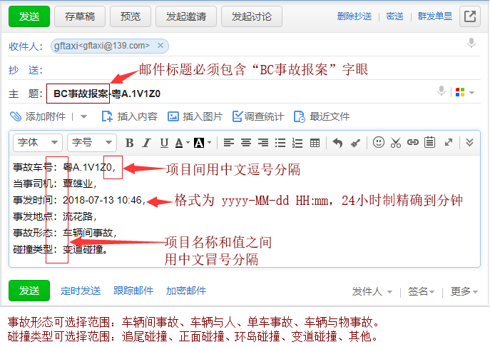

# 邮件报案指引

业务人员通过向公司邮箱 `gftaxi@139.com` 发送包含 "BC事故报案" 字眼标题的邮件来实现邮件报案。

系统会每隔 5 分钟收取一次这些邮件，然后自动上报到 BC 系统事故报案模块内。

## 邮件格式要求

1. 邮件标题格式：BC事故报案-粤A.12345
2. 邮件内容格式
    ```
    事故车号：粤A.12345，
    当事司机：小明，
    事发时间：2018-07-01 12:13，
    事发地点：广卫路步行街，
    事故形态：车辆间事故|车辆与人|单车事故|车辆与物事故，
    碰撞类型：追尾碰撞|环岛碰撞|变道碰撞|其他。
    ```

事故形态可选择范围：车辆间事故、车辆与人、单车事故、车辆与物事故。

碰撞类型可选择范围：追尾碰撞、环岛碰撞、变道碰撞、其他。

## 139邮件样例

